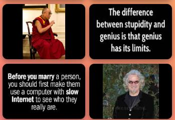
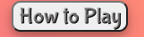
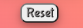

# Famous Quote Matcher

Welcome to the Famous Quote Matcher. The memory game was created to help fill those times when you need abit of relaxation. I created the memory game because it was one of my favorite games when I was growing up. I found that it challenged me mentally and helped me improve my memory, while having fun.

Famous Quote Matcher has been designed so anyone can enjoy this simple but enjoyable game. I have used quotes instead of the traditional picture cards, so that the user can learn something while they play. I decided that the quotes used would be from Iconic people that have changed so many lives. I wanted the quotes to informative and funny so the user would hopefully find them funny and informative.

Heres a screenshot of the website for to see from amiresponsive 

https://ui.dev/amiresponsive?url=https://pimmz.github.io/Project-2

## Design Process (UX)

When I started the design of Famous Quote Matcher I wanted to ensure the site was Useful, Useable and Valuable, so that it makes the user experience informative and enjoyable. To do this I looked at the five key fundamentals;
                            
Stragety - So the user can enjoy this simple, enjoyable, memory game while learning alittle bit aboutsome of our greatest icons.

Scope - Based on the information from the stategy, the features included emotive images, which offered key information to the quote the famous person said. A timer so the user can see what their best was, so they can try to beat it. I also included a section so they can see how many guesses they made so they can not only complete the game as fast as possible but also do it in the least amount of moves. A how to play feature was also included so the use can see how to play the game if they are not familiar with this particular game. The option to reset the game was also included so they can put the game back to the start at any point.

Structure - This was designed around the user. After speaking with a number of the general public, they wanted to know how to play the game?, the time they taken to complete it, the amount of guesses they had taken and to have the ability to reset the game at any time.

Skeleton - As before this was designed around the user which was gained from information supplied by the general public. This dictated that it would be one page, laid out simply. So that it can be used quickly and effeciently, while delivering the most amount of fun and gaining a small amount of knowledge as well.

Surface - I wanted the look of Famous Quote Matcher to be informative, clear, concise, with consistent typography and coresponding colours to help them stand out, to easily navigated with emotive pictures that helped to bring an element of fun which I believe we all need on a daily basis.

Then I sat down and roughly sketched out onto paper what the screens would look like in a mobile, tablet and  desktop,  This then gave me the basis to start creating Famous Quote Matcher in Codeanywhere.

### Colour Scheme

For the color scheme I used the below colours for;

- `white` was used for primary text.
- `rgb(247, 224, 224);` was used for primary highlights.
- `box-shadow: 0 4px 8px 0 rgba(0, 0, 0, 0.2), 0 6px 20px 0 rgba(0, 0, 0, 0.19);` was used for the box shadow.
- `black` was used for secondary highlights.

To help with the colour choice I used my color space https://mycolor.space/ it allowed me to generate the colours that best matched the game background. 

Please follow the link to mycolorspace, https://mycolor.space/gradient3?ori=to+right+top&hex=%23845EC2&hex2=%23FF9671&hex3=%23F9F871&submit=submit 

Screenshot also attached incase the link dosent load;

### Typography

I looked for font on google fonts, to help me decide as it gave a better visual aid for me to see how they all looked in there different weights. After many hours trying the fonts out on mt game, I decide to use Bubblegum Sans all the way through to ensure a good balance, with a consitent look and feel. As a back up I used sans-serif as it has a great look and then my third choice was serif as a fall back incase the other two werent available.

- [bubblegum sans](https://fonts.google.com/specimen/Bubblegum+Sans?query=bubble) was used for the all the text and headers.

## Icons

To help with making Famous Quote Matcher as user friendly as possible I used icons from font awesome. This helped highlight specific areas to bring the user attention to it.

- [Font Awesome](https://fontawesome.com) icons were used in the title.

## User Stories

### New Site Users

- As a new site user, I would like to be able to switch of, so that I can relax my mind.
- As a new site user, I would like to be challenged mentally, so that I can have a challenge myself.
- As a new site user, I would like to improve my memory, so that I can remember more things.
- As a new site user, I would like to have fun, so that I can enjoy myself and unwind from a busy day.
- As a new site user, I would like to learn something, so that I can improve my knowledge.

### Returning Site Users

- As a returning site user, I would like to be able to switch of, so that I can relax my mind.
- As a returning site user, I would like to be challenged mentally, so that I can have a challenge myself.
- As a returning site user, I would like improve my memory, so that I can remember more things.
- As a returning site user, I would like to have fun, so that I can enjoy myself and unwind from a busy day.

### Site Admin

- As a site administrator, I should be able to understand why something has been written, so that I can navigate the code easily.

## Wireframes

To follow best practice, wireframes were developed for mobile, tablet, and desktop sizes.

I've used [Balsamiq](https://balsamiq.com/wireframes) to design my site wireframes. 

The direct link is here https://balsamiq.cloud/s9ei7tz/phsyq6e/rFF21?f=N4IgUiBcAMA0IDkpxAYWfAMlAjPAQrvALJEgBaZA0lANoC6AvkA%3D

### Home Page Wireframes

| Size | Screenshot |
| --- | --- |
| Mobile |  |
| Tablet |  |
| Desktop |  |

## Features

Famous Quote Matcher has been designed so anyone can enjoy this simple but challenging game. I have used quotes instead of the traditional picture cards, so that the user can learn something while they play.
The feature were designed around the user. After speaking with a number of the general public, they wanted to know, how to play the game?, the time they taken to complete it, the amount of guesses they had taken and to have the ability to reset the game at any time.

- **Title Feature #1**

    - Fun, catchy and informative title. As fun is the main aim of the game, bubblegum sans font was choosen so that it wasnt a very formal title, giving it a warm feeling, helping to draw the user into playing it. The name was choosen to be catchy and informative so the user can easily understand what the game is about so they can look forward to playing  it.

- **Timer & Guesses made Feature #2**

    - Guesses made and Timer feature. In order for the game to have a real edge of competition and following the feedback from the public, the guesses made feature was added so that the user can constantly challenge themselves to get a lower amount of guesses. The timer feature was also added for the same reasons plus it adds a sense of pressure to the game, so that the user completes the game in as little time as possible.

 

- **Quote card feature #3**

    - Famous Quote Matcher has been designed so anyone can enjoy this simple and challenging game. The memory game is a great way to enjoy and challenge yourself.
    I have used quotes instead of the traditional picture cards, so that the user can learn something while they play and to add abit more of a fun element I selected quotes that hopefully make the user laugh. Plus learn abit of information about a famous icon. Which will in turn make the whole experience that much more entertaining.

- **How to play feature #4**

    - The how to play feature was added after feedback from the general public. Although this is a quite straight forward game to play, it was felt that it would clear up any uncertainty if it was explained how to play the game. making the experience that much more clearer and enjoyable to the user.

- **Reset feature #5**

    - The reset button was added following feedback from the general public and as part of a main requirement for the game. In order for it to be reset once the user had completed the game. This way once all the cards had been turned over, you can simply press the reset button and the game turns all the cards over and sets the guesses made and timer to zero. Making it ready to play.

### Future Features

- Shuffle feature
    - So the game would get more challenging I would like to add a shuffle feature so that you didnt aways know exactly where the cards wouls be situated.

- Adding alot more cards. 
    - I would love to add alot more cards to the existing eight. because currently it is quite easy to complete, where as if there was alot more, potentially upto 32 cards it would give the user a real challenge to match the quotes to the famous person.

- User sign in option.
    - Having the option to allow the user to sign in on a individual log in would be a great addition to the game, so that the user would have a more personal and private game playing experience.

-  emailing the score to the user.
    - It would be a great addtion to the game to be able to email the end score to the user so they knew what score they achieved.

-  Hi score board.
    - Having a hi score board would be a fantastic way of making the game more competitve. Being able to see other peoples times they had completed the game in would create a real challenge for the user to beat their times or constantly try to improve their own time.

## Tools & Technologies Used

- [HTML](https://en.wikipedia.org/wiki/HTML) used for the main site content.
- [CSS](https://en.wikipedia.org/wiki/CSS) used for the main site design and layout.
- [CSS Flexbox](https://www.w3schools.com/css/css3_flexbox.asp) used for an enhanced responsive layout.
- [JavaScript](https://www.javascript.com) used for user interaction on the site.
- [Git](https://git-scm.com) used for version control. (`git add`, `git commit`, `git push`)
- [GitHub](https://github.com) used for secure online code storage.
- [GitHub Pages](https://pages.github.com) used for hosting the deployed front-end site.
- [Gitpod](https://gitpod.io) used as a cloud-based IDE for development.
- [Codeanywhere](https://app.codeanywhere.com/) used as a cloud-based IDE for development.
- [Balsamiq](https://balsamiq.com/) used for making the wireframes.
- [Mycolor.space](https://mycolor.space/) used to choose the color scheme

## Testing

For all testing, please refer to the [TESTING.md](TESTING.md) file.

## Deployment

The site was deployed to GitHub Pages. The steps to deploy are as follows:
- In the [GitHub repository](https://github.com/Pimmz/Project-2), navigate to the Settings tab 
- From the source section drop-down menu, select the **Main** Branch, then click "Save".
- The page will be automatically refreshed with a detailed ribbon display to indicate the successful deployment.

The live link can be found [here](https://pimmz.github.io/Project-2)

### Local Deployment

This project can be cloned or forked in order to make a local copy on your own system.

#### Cloning

You can clone the repository by following these steps:

1. Go to the [GitHub repository](https://github.com/Pimmz/Project-2) 
2. Locate the Code button above the list of files and click it 
3. Select if you prefer to clone using HTTPS, SSH, or GitHub CLI and click the copy button to copy the URL to your clipboard
4. Open Git Bash or Terminal
5. Change the current working directory to the one where you want the cloned directory
6. In your IDE Terminal, type the following command to clone my repository:
	- `git clone https://github.com/Pimmz/Project-2.git`
7. Press Enter to create your local clone.

Alternatively, if using Gitpod, you can click below to create your own workspace using this repository.

Please note that in order to directly open the project in Gitpod, you need to have the browser extension installed.
A tutorial on how to do that can be found [here](https://www.gitpod.io/docs/configure/user-settings/browser-extension).

#### Forking

By forking the GitHub Repository, we make a copy of the original repository on our GitHub account to view and/or make changes without affecting the original owner's repository.
You can fork this repository by using the following steps:

1. Log in to GitHub and locate the [GitHub Repository](https://github.com/Pimmz/Project-2)
2. At the top of the Repository (not top of page) just above the "Settings" Button on the menu, locate the "Fork" Button.
3. Once clicked, you should now have a copy of the original repository in your own GitHub account!

### Local VS Deployment

Due to the simpdifferences between the local version you've developed, and the live deployment site on GitHub Pages.

## Credits

- [HTML](https://stackoverflow.com/) used to assist with styles throughout the site.
- [CSS/HTML](https://mycolor.space/) used to assist with the choice of colours through the site.
- [Images](https://www.pixabay.com/) used to assist with picking of the card photos.
- [Images](https://www.pinterest.co.uk) used to assist with getting the quotes for the cards.
- [Images](https://www.azquotes.com) used to assist with getting the quotes for the cards.
- [Images](https://www.dreamstime.com) used to assist with picking of the card photos.
- [Images](https://www.idlehearts.com) used to assist with getting the quotes for the cards.

- [HTML](https://www.w3schools.com/css/css3_variables.asp) used to assist with code throughout the site.
- [CSS](https://www.w3schools.com/css/css3_variables.asp) used to assist with styles throughout the site.
- [Git](https://git-scm.com) used for version control. (`git add`, `git commit`, `git push`)
- Tutor support at code institute
- Tim Nelson Mentor at code institute
- Love running project at code institute
### Content

⚠️⚠️⚠️⚠️⚠️ START OF NOTES (to be deleted) ⚠️⚠️⚠️⚠️⚠️

Use this space to provide attribution links to any borrowed code snippets, elements, or resources.
A few examples have been provided below to give you some ideas.

Ideally, you should provide an actual link to every resource used, not just a generic link to the main site!

🛑🛑🛑🛑🛑 END OF NOTES (to be deleted) 🛑🛑🛑🛑🛑

| Source | Location | Notes |
| --- | --- | --- |
| [Markdown Builder](https://traveltimn.github.io/markdown-builder) | README and TESTING | tool to help generate the Markdown files |
| [Chris Beams](https://chris.beams.io/posts/git-commit) | version control | "How to Write a Git Commit Message" |
| [W3Schools](https://www.w3schools.com/howto/howto_js_topnav_responsive.asp) | entire site | responsive HTML/CSS/JS navbar |
| [W3Schools](https://www.w3schools.com/howto/howto_css_modals.asp) | contact page | interactive pop-up (modal) |
| [W3Schools](https://www.w3schools.com/css/css3_variables.asp) | entire site | how to use CSS :root variables |
| [Flexbox Froggy](https://flexboxfroggy.com/) | entire site | modern responsive layouts |
| [Grid Garden](https://cssgridgarden.com) | entire site | modern responsive layouts |
| [StackOverflow](https://stackoverflow.com/a/2450976) | quiz page | Fisher-Yates/Knuth shuffle in JS |
| [YouTube](https://www.youtube.com/watch?v=YL1F4dCUlLc) | leaderboard | using `localStorage()` in JS for high scores |
| [YouTube](https://www.youtube.com/watch?v=u51Zjlnui4Y) | PP3 terminal | tutorial for adding color to the Python terminal |
| [strftime](https://strftime.org) | CRUD functionality | helpful tool to format date/time from string |
| [WhiteNoise](http://whitenoise.evans.io) | entire site | hosting static files on Heroku temporarily |

### Media

⚠️⚠️⚠️⚠️⚠️ START OF NOTES (to be deleted) ⚠️⚠️⚠️⚠️⚠️

Use this space to provide attribution links to any images, videos, or audio files borrowed from online.
A few examples have been provided below to give you some ideas.

If you're the owner (or a close acquaintance) of all media files, then make sure to specify this.
Let the assessors know that you have explicit rights to use the media files within your project.

Ideally, you should provide an actual link to every media file used, not just a generic link to the main site!
The list below is by no means exhaustive. Within the Code Institute Slack community, you can find more "free media" links
by sending yourself the following command: `!freemedia`.

🛑🛑🛑🛑🛑 END OF NOTES (to be deleted) 🛑🛑🛑🛑🛑

| Source | Location | Type | Notes |
| --- | --- | --- | --- |
| [Pexels](https://www.pexels.com) | entire site | image | favicon on all pages |
| [Lorem Picsum](https://picsum.photos) | home page | image | hero image background |
| [Unsplash](https://unsplash.com) | product page | image | sample of fake products |
| [Pixabay](https://pixabay.com) | gallery page | image | group of photos for gallery |
| [Wallhere](https://wallhere.com) | footer | image | background wallpaper image in the footer |
| [This Person Does Not Exist](https://thispersondoesnotexist.com) | testimonials | image | headshots of fake testimonial images |
| [Audio Micro](https://www.audiomicro.com/free-sound-effects) | game page | audio | free audio files to generate the game sounds |
| [Videvo](https://www.videvo.net/) | home page | video | background video on the hero section |
| [TinyPNG](https://tinypng.com) | entire site | image | tool for image compression |

### Acknowledgements

⚠️⚠️⚠️⚠️⚠️ START OF NOTES (to be deleted) ⚠️⚠️⚠️⚠️⚠️

Use this space to provide attribution to any supports that helped, encouraged, or supported you throughout the development stages of this project.
A few examples have been provided below to give you some ideas.

🛑🛑🛑🛑🛑 END OF NOTES (to be deleted) 🛑🛑🛑🛑🛑

- I would like to thank my Code Institute mentor, [Tim Nelson](https://github.com/TravelTimN) for their support throughout the development of this project.
- I would like to thank the [Code Institute](https://codeinstitute.net) tutor team for their assistance with troubleshooting and debugging some project issues.
- I would like to thank the [Code Institute Slack community](https://code-institute-room.slack.com) for the moral support; it kept me going during periods of self doubt and imposter syndrome.
- I would like to thank my partner (John/Jane), for believing in me, and allowing me to make this transition into software development.
- I would like to thank my employer, for supporting me in my career development change towards becoming a software developer.
